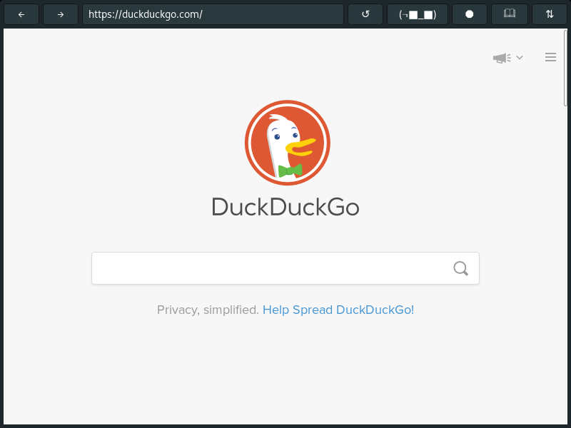

# SWB (Simple Web Browser)

## Description

Pronounced as "swub" /swʌb/

A Web Browser should be a Web Browser and nothing more, and it should integrate well with your system.

Goals:
1. Built with GTK/Qt to integrate with DEs (using gtk3 and webkitgtk)
2. The following "extra" features I consider necessary (but nothing else):
  - Adblock (done)
  - Bookmark sync (currently working on)
  - Password sync and autofill (not started)
3. Mobile client (not started)
4. Decent performance, i.e. built on top 3 engines: Blink, Gecko, or WebKit (WebKit currently)
5. No added privacy concerns out of the box (no telemetry, ads, or data collection)
6. Not built on Chromium/Blink (it's WebKit, so we're good)

Officially supported platforms: Fedora. Will probably make a Flatpak.

## Build

Obviously, all this will be handled by the package, but if you're building from source, this is what you've gotta do.

First, install Dependencies:
- cargo
- webkit2gtk libs
- gtk3 libs
- pkgconf
- Linux

To simply try it out, from the repo folder, run `cargo run`

If you want to install it somewhere:
- Build with `cargo build --release`
- Copy the binary "swb" from target/release to /usr/bin/
- Create the folder `~/.config/swb`
- Create a plugins/ folder in the install location, `~/.config/swb`, and copy into it the libswb_bookmarks.so and libswb_webkit.so files from target/release/
- Copy swb.desktop to /usr/share/applications and copy swb-icon.png /usr/share/pixmap

Again, once the package is made, it will do all that jazz for you

## Architecture

The browser itself is built around plugins.

Want to use Firefox sync for bookmarks instead of my system? Go ahead and make a plugin for that

Want a different adblock? Go for it

Want to switch to a completely different browser engine? Be my guest!

The default system will use:
- An adblocker built on easylist
- Bookmark sync to my personal server
- Password sync on my personal server
- WebKit Gtk

The actual main window contains:
- a container for the web page rendering
- back and forward buttons
- a search bar
- a refresh button
- a bookmarks menu including a folders system
- a sync menu for loggin in/logging out
- a button for updating the adblocker filter rules.

Events from the main window like searching or creating a bookmark call plugins to do the dirty work. To see what the plugin supports, look in `core/src/plugin.rs`

The mobile app has yet to be thought about. Might try to compile for WebAsm, create a webview wrapper for android, and get it to run in that, or I might try to actually make a new interface. Has not been decided yet.

